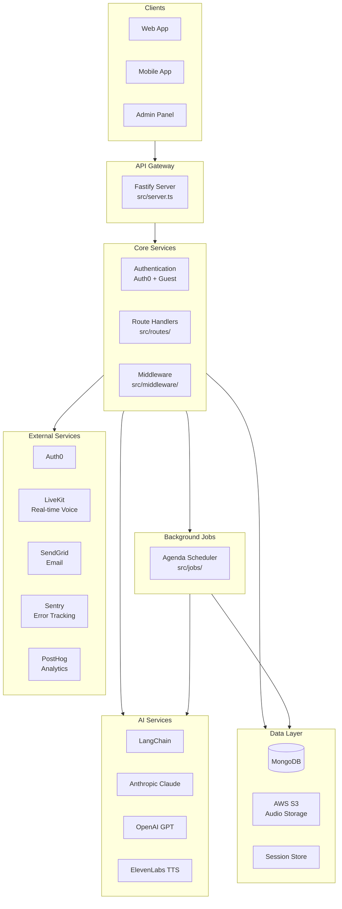
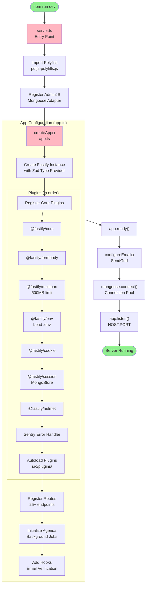
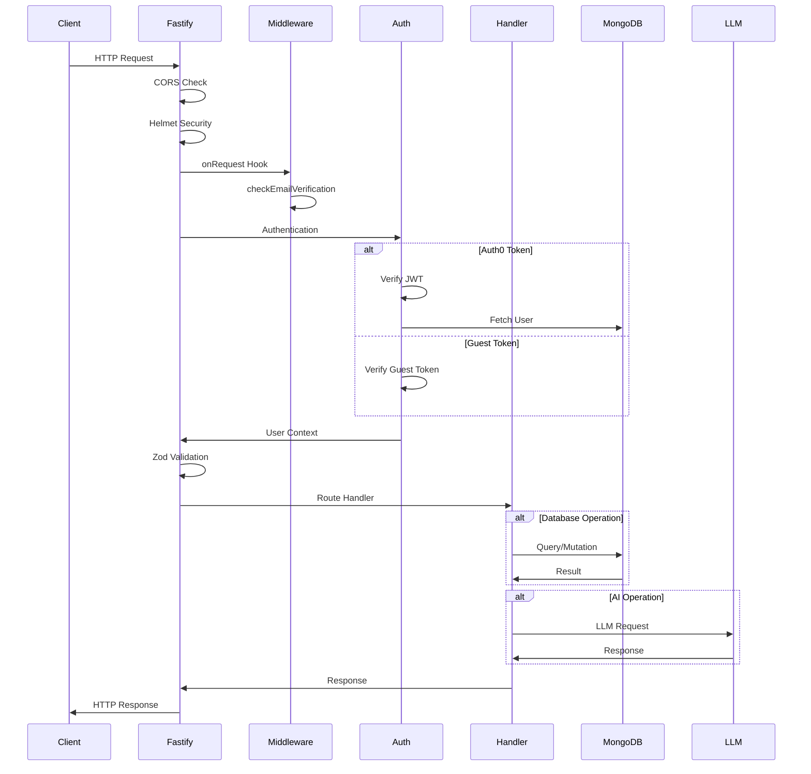
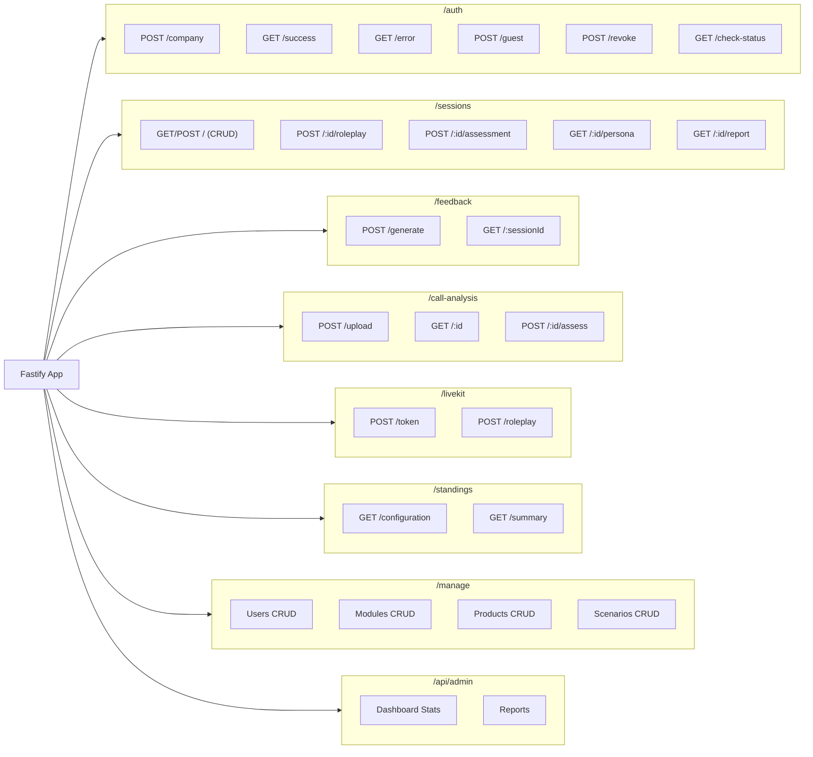
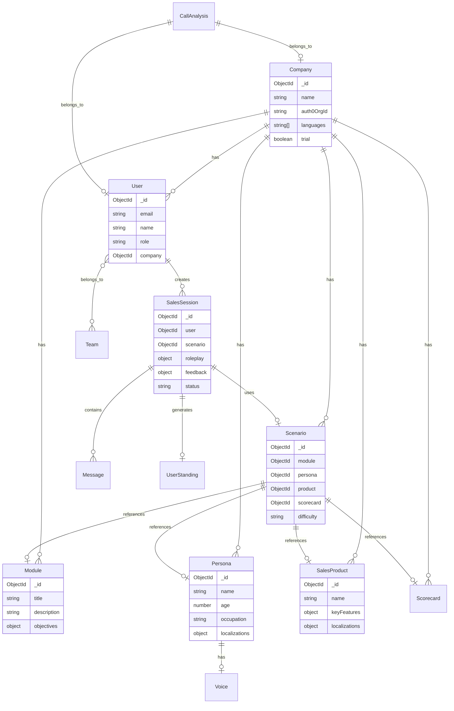
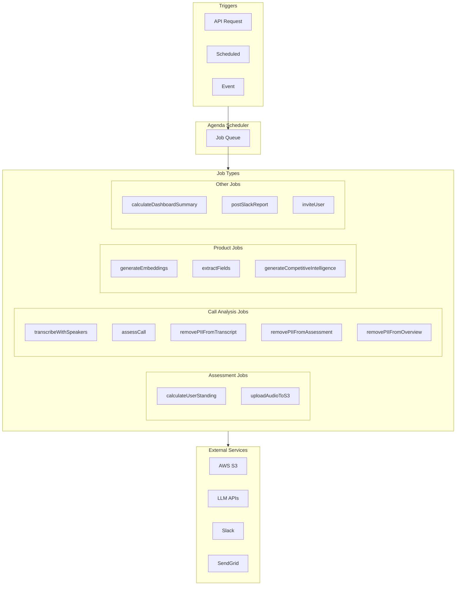
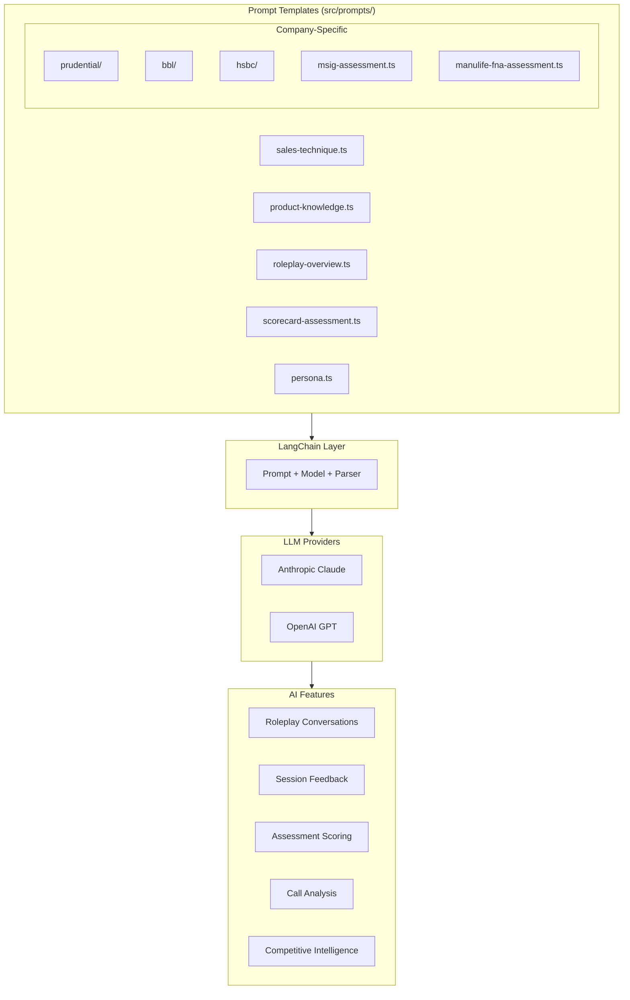
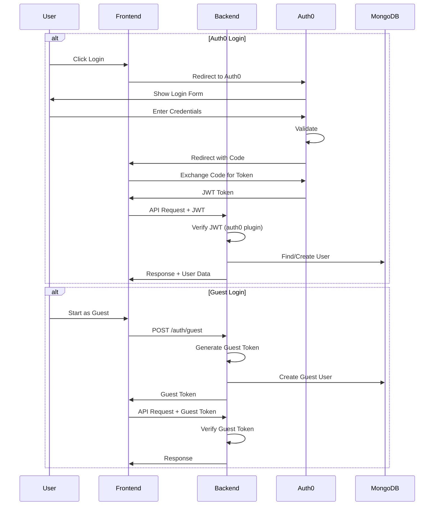

# Architecture Overview

> Interactive architecture diagrams for the AISales Backend. These diagrams render automatically on GitHub and in VS Code with Mermaid extensions.

## Table of Contents
- [System Overview](#system-overview)
- [Startup Flow](#startup-flow)
- [Request Lifecycle](#request-lifecycle)
- [Route Structure](#route-structure)
- [Data Models](#data-models)
- [Background Jobs](#background-jobs)
- [AI/LLM Integration](#aillm-integration)
- [Authentication Flow](#authentication-flow)
- [Key File Reference](#key-file-reference)

---

## System Overview



---

## Startup Flow

The application boots in a specific sequence. Click through to understand each step.



### Key Files in Startup

| Order | File | Purpose |
|-------|------|---------|
| 1 | `src/server.ts` | Entry point, MongoDB connection, shutdown handlers |
| 2 | `src/app.ts` | Fastify app creation, plugin & route registration |
| 3 | `src/env.ts` | Environment validation with Zod |
| 4 | `src/plugins/*.ts` | Custom Fastify plugins (auth, s3, admin, etc.) |
| 5 | `src/jobs/agenda.ts` | Background job scheduler initialization |

---

## Request Lifecycle

Every HTTP request flows through this pipeline:



---

## Route Structure



---

## Data Models

### Entity Relationship Diagram



### Core Model Files

| Model | File | Key Fields |
|-------|------|------------|
| User | `src/models/User.ts` | email, role, company, teams |
| Company | `src/models/Company.ts` | name, auth0OrgId, languages |
| SalesSession | `src/models/SalesSession.ts` | user, scenario, roleplay, feedback |
| Scenario | `src/models/Scenario.ts` | module, persona, product, scorecard |
| Persona | `src/models/Persona.ts` | name, age, occupation, voice |
| Module | `src/models/Module.ts` | title, description, objectives |
| SalesProduct | `src/models/SalesProduct.ts` | name, keyFeatures, callCriteria |
| Message | `src/models/Message.ts` | session, role, content |

---

## Background Jobs



### Job Files

| Job | File | Purpose |
|-----|------|---------|
| calculateUserStanding | `src/jobs/assessment/calculateUserStanding.ts` | Update user performance metrics |
| uploadAudioToS3 | `src/jobs/assessment/uploadAudioToS3.ts` | Store session audio |
| transcribeWithSpeakers | `src/jobs/call-analysis/transcribeWithSpeakers.ts` | Speech-to-text with diarization |
| assessCall | `src/jobs/call-analysis/assessCall.ts` | AI analysis of call |
| postSlackReport | `src/jobs/report/postSlackReport.ts` | Daily Slack reports |

---

## AI/LLM Integration



### Prompt Organization

```
src/prompts/
├── sales-technique.ts      # Sales technique assessment
├── product-knowledge.ts    # Product knowledge evaluation
├── roleplay-overview.ts    # Roleplay session summary
├── scorecard-assessment.ts # Scorecard-based evaluation
├── persona.ts              # Persona generation
├── sales-voice.ts          # AI voice personality
│
├── prudential/             # Prudential-specific prompts
├── bbl/                    # BBL-specific prompts
├── hsbc/                   # HSBC-specific prompts
└── realtime-feedback/      # Live feedback prompts
```

---

## Authentication Flow



### Auth Files

| File | Purpose |
|------|---------|
| `src/plugins/auth0.ts` | Auth0 JWT verification plugin |
| `src/middleware/conditionalAuth.ts` | Universal auth setup (Auth0 + Guest) |
| `src/routes/auth/guest.ts` | Guest token generation |
| `src/routes/auth/success.ts` | OAuth callback handler |

---

## Key File Reference

### Entry Points
| File | Purpose | Link |
|------|---------|------|
| `src/server.ts` | Application entry point | [View](../src/server.ts) |
| `src/app.ts` | Fastify app configuration | [View](../src/app.ts) |
| `src/env.ts` | Environment configuration | [View](../src/env.ts) |

### Core Directories
| Directory | Purpose |
|-----------|---------|
| `src/models/` | MongoDB schemas (24 models) |
| `src/routes/` | API endpoints (14 modules) |
| `src/plugins/` | Fastify plugins (5 plugins) |
| `src/middleware/` | Request middleware |
| `src/jobs/` | Background jobs (15 jobs) |
| `src/prompts/` | LLM prompt templates |
| `src/utils/` | Shared utilities |
| `src/pdf/` | PDF report generation |

### Configuration Files
| File | Purpose |
|------|---------|
| `CLAUDE.md` | AI assistant guidelines |
| `package.json` | Dependencies & scripts |
| `tsconfig.json` | TypeScript config |
| `.prettierrc` | Code formatting |
| `pm2.config.cjs` | Production process manager |

---

## Quick Start for New Engineers

1. **Read First**: `CLAUDE.md` for coding patterns
2. **Run Locally**: `npm install && npm run dev`
3. **Explore Admin**: Visit `http://localhost:5000/admin`
4. **Trace a Request**: Follow `server.ts` → `app.ts` → any route
5. **Understand Models**: Start with `User.ts` → `SalesSession.ts`
6. **Check Tests**: Run `npm test` to see expected behavior

---

*Last updated: Generated automatically*
