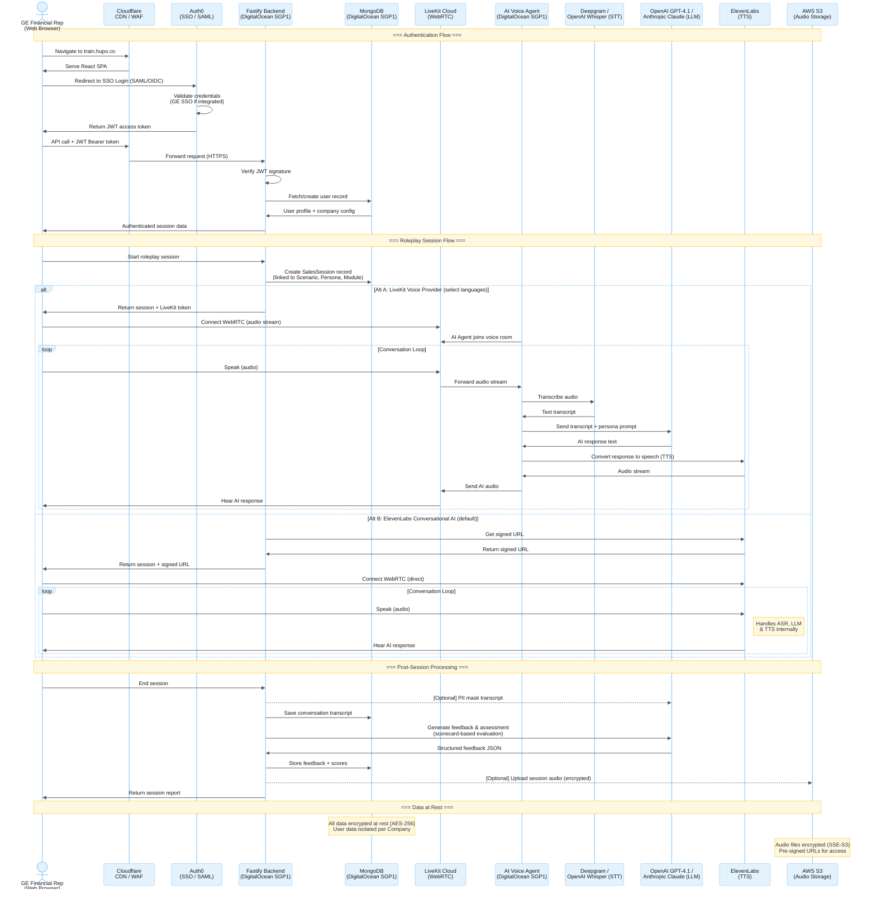

# Data Flow Diagram

> For GE questionnaire — Section 1: High-Level Hosting & Integration Posture

## Data Flow Summary

### Authentication
1. User opens `train.hupo.co` in browser (HTTPS only)
2. Redirected to Auth0 for SSO login (supports SAML for GE IdP integration)
3. JWT token issued and used for all subsequent API calls
4. Backend verifies JWT on every request; user record fetched from MongoDB

### Roleplay Session (Two Voice Providers)

**Alt A: LiveKit Voice Provider** (used for select languages: Thai, Tagalog, Cebuano, Cantonese)
1. User starts a session — backend creates a `SalesSession` record in MongoDB
2. Backend generates a LiveKit access token and dispatches AI Voice Agent
3. User connects to LiveKit Cloud via WebRTC (audio only)
4. AI Agent (Python, hosted on DigitalOcean) joins the same voice room
5. **Conversation loop (3-stage pipeline):**
   - **STT:** User speaks → audio forwarded to Agent → Deepgram/OpenAI Whisper transcribes to text
   - **LLM:** Agent sends transcript + persona prompt → OpenAI GPT-4.1 / Anthropic Claude generates response
   - **TTS:** Agent sends response to ElevenLabs → text-to-speech → audio streamed back to user

**Alt B: ElevenLabs Conversational AI** (default provider)
1. User starts a session — backend creates a `SalesSession` record in MongoDB
2. Backend requests a signed URL from ElevenLabs
3. User connects directly to ElevenLabs via WebRTC
4. **Conversation loop:** User speaks → ElevenLabs handles ASR, LLM & TTS internally → User hears AI
5. No AI Voice Agent hosted on our infrastructure — everything runs on ElevenLabs servers

### Post-Session
1. *(Optional)* PII mask transcript via LLM before saving
2. Transcript saved to MongoDB
3. LLM generates structured feedback and scorecard assessment
4. Feedback and scores stored in MongoDB
5. *(Optional)* Audio uploaded to AWS S3 (encrypted at rest with SSE-S3)
6. User receives a session report

### Data Isolation
- All records are scoped to a `company_id` field
- GE users only see GE data; no cross-tenant data access
- Auth0 Organization feature enforces company-level login isolation
