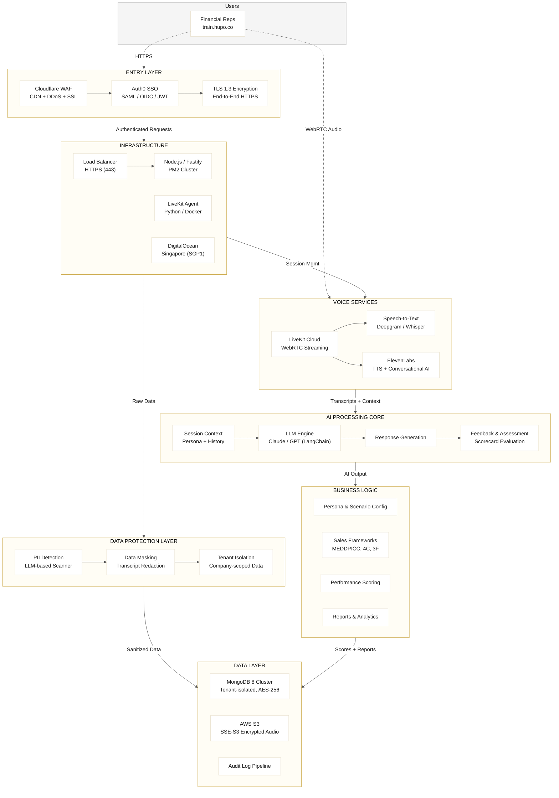

# High-Level Architecture Diagram

> For GE questionnaire — Section 1: High-Level Hosting & Integration Posture

## Summary

| Component | Provider | Region | Notes |
|-----------|----------|--------|-------|
| **Frontend (SPA)** | Cloudflare Pages | Global CDN | React, browser-only |
| **CDN / WAF** | Cloudflare | Global | DDoS protection, SSL termination |
| **Authentication** | Auth0 (Global SaaS) | US | SAML / OIDC, JWT, multi-tenant SSO |
| **Backend API** | DigitalOcean | Singapore (SGP1) | Node.js / Fastify, PM2 cluster |
| **Database** | DigitalOcean Managed | Singapore (SGP1) | MongoDB 8, Primary + 2 Standbys, AES-256 |
| **Voice AI Agent** | DigitalOcean | Singapore (SGP1) | Python, Docker container |
| **Voice Server** | LiveKit Cloud (Global SaaS) | Multi-region | WebRTC real-time streaming |
| **Audio Storage** | AWS S3 | ap-southeast-1 | SSE-S3 encryption |
| **Media CDN** | AWS CloudFront | Global | Static assets |
| **AI/LLM** | Anthropic / OpenAI | US | Via LangChain |
| **TTS / Conversational AI** | ElevenLabs | Global | Voice synthesis + direct mode |
| **STT** | Deepgram / OpenAI Whisper | Global | Speech-to-text |
| **Error Tracking** | Sentry | Global SaaS | |
| **Analytics** | PostHog | Global SaaS | |
| **Email** | SendGrid | Global SaaS | Transactional email |

## Architecture Layers

### Entry Layer
All user traffic enters through Cloudflare (CDN, WAF, DDoS protection, SSL termination), then authenticates via Auth0 (supports SAML for GE IdP integration). All communication is TLS 1.3 encrypted end-to-end.

### Infrastructure
Application runs on DigitalOcean Singapore (SGP1) with a managed load balancer. The Fastify backend runs in PM2 cluster mode. A separate LiveKit Agent (Python, Docker) handles real-time voice AI processing.

### Voice Services
Two voice provider paths: **LiveKit** (STT → LLM → TTS pipeline for select languages) and **ElevenLabs Conversational AI** (all-in-one default). Speech-to-text via Deepgram / OpenAI Whisper. Text-to-speech via ElevenLabs.

### Data Protection Layer
PII detection using LLM-based scanning before data storage. Data masking engine redacts sensitive information from transcripts. All data is tenant-isolated with company-scoped boundaries.

### AI Processing Core
LLM engine (Anthropic Claude / OpenAI GPT via LangChain) handles response generation during roleplay sessions. Session context manager maintains persona prompts and conversation history. Feedback and assessment engine provides scorecard-based evaluation.

### Business Logic
Configurable personas, scenarios, and sales training modules (MEDDPICC, 4C, 3F, Strategic Pitch, etc.). Performance scoring with detailed scorecards. Reports and session analytics.

### Data Layer
MongoDB 8 cluster with tenant isolation (company-scoped), encrypted at rest (AES-256). Audio files stored in AWS S3 with SSE-S3 encryption. Audit log pipeline for access tracking.
