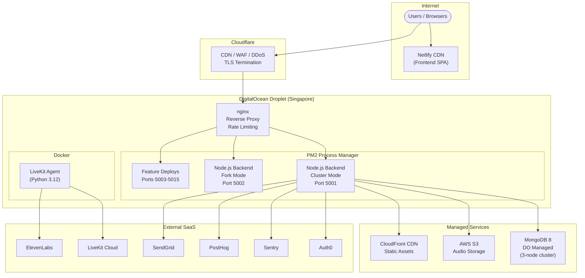
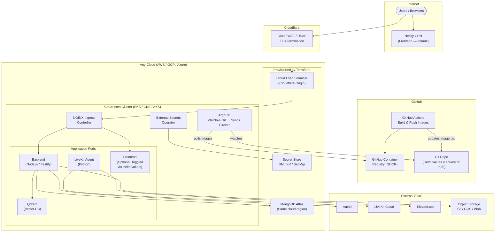

# Containerization Design — Sales AI Platform

**Date**: 2026-03-09
**Goal**: Containerize the Sales AI platform to enable deployment on any major cloud (AWS, GCP, Azure) via Kubernetes + Terraform.

---

## 1. Current State



**Deployment method**: GitHub Actions → SSH into droplet → `git pull` → `npm ci` → `npm run build` → `pm2 restart`. LiveKit agent has a separate blue-green Docker deployment script.

---

## 2. Target State



---

## 3. Technology Choices & Reasoning

### Kubernetes (over managed container services like ECS/Cloud Run)

We considered simpler managed container services (AWS ECS, GCP Cloud Run, Azure Container Apps) vs Kubernetes. We chose Kubernetes because:
- **3 services that talk to each other** (backend, LiveKit agent, Qdrant) — managed container services handle each service independently, making inter-service networking awkward
- **True multi-cloud portability** — with managed services, the Docker image is portable but the deployment config is different per cloud. With K8s, both the image AND the manifests are (nearly) identical across clouds
- **We know we need it long-term** — starting with simpler services and migrating later means doing the work twice

### Terraform (for infrastructure provisioning)

Terraform provisions the cloud infrastructure (K8s cluster, networking, secret stores, DNS, MongoDB Atlas). One set of modules, composed differently per cloud provider. This is the standard tool for multi-cloud IaC.

### Helm (over Kustomize or raw YAML)

We need to define K8s manifests (Deployments, Services, Ingress, etc.) and vary config per environment. Three options were considered:
- **Raw YAML**: copy-paste per environment, unmaintainable at scale
- **Kustomize**: base + patch overlays, simpler but limited — no conditionals, no loops, breaks down with many varying parameters
- **Helm**: templates with `{{ .Values }}` placeholders, values files per environment, supports conditionals (e.g., `if frontend.enabled`), loops, and dependencies

We chose Helm because: we'll have multiple environments (prod, staging, per-client), optionally toggle the frontend, and third-party components (ArgoCD, NGINX Ingress, cert-manager) all ship as Helm charts — using Helm everywhere keeps the toolchain consistent.

### ArgoCD (over plain GitHub Actions kubectl apply)

Two CI/CD approaches were considered:
- **GitHub Actions only**: CI builds image, then runs `kubectl apply` directly against the cluster. Simple, but requires cluster credentials in CI (security risk), no drift detection, rollback means re-running an old pipeline.
- **ArgoCD (GitOps)**: CI only builds and pushes images + updates a tag in git. ArgoCD, running inside the cluster, watches git and syncs automatically. No cluster credentials in CI. Git history = deployment history. Auto-rollback on failed health checks. Web dashboard for visibility. Drift detection corrects manual cluster changes.

We chose ArgoCD because: it eliminates the security risk of storing cluster credentials in GitHub Actions, provides a deployment audit trail via git commits, and adds auto-rollback and drift protection with minimal extra setup (one Helm install).

### GHCR — GitHub Container Registry (over per-cloud registries)

Three options were considered:
- **Per-cloud registry** (ECR/GCR/ACR): faster pulls (same network), but Terraform must provision a registry per cloud, and CI pushes to multiple registries
- **GHCR as primary, mirror to cloud**: best of both, but more CI complexity
- **GHCR only**: comes with GitHub, native GHA authentication, zero Terraform needed, one registry for all clouds

We chose GHCR because: it's already tied to the GitHub org, requires zero provisioning, and pull speeds are fine for container deployments. Cloud-specific mirroring can be added later if latency becomes an issue.

### External Secrets Operator (over Sealed Secrets or HashiCorp Vault)

Three options for secret management in K8s:
- **Sealed Secrets**: secrets encrypted in git, decrypted in-cluster. Simple but no audit trail, rotation means git commits, secrets live in the repo (even encrypted).
- **External Secrets Operator**: cloud-agnostic K8s operator that syncs secrets from AWS Secrets Manager / GCP Secret Manager / Azure Key Vault. The operator is the same everywhere; only the `SecretStore` config changes per cloud. Audit logs, rotation, and access control come free from the cloud provider.
- **HashiCorp Vault**: cloud-agnostic but another service to run and manage.

We chose External Secrets Operator because: it provides cloud-native audit trails and rotation with minimal overhead (~5 lines of Terraform per cloud for the secret store + one Helm install for the operator). Much better security posture than Sealed Secrets, without the operational burden of running Vault.

### MongoDB Atlas (over per-cloud managed MongoDB)

Three options:
- **Per-cloud managed** (DocumentDB on AWS, Cosmos DB on Azure): different compatibility levels, different Terraform configs, potential behavior differences
- **Self-hosted MongoDB in K8s**: fully portable but we own backups, replication, upgrades — risky for production data
- **MongoDB Atlas**: runs on all 3 clouds via one provider, has a Terraform provider, consistent behavior everywhere. If a specific client can't use Atlas, Terraform can swap in DocumentDB/Cosmos as a fallback.

We chose Atlas because: single vendor, single Terraform provider, consistent MongoDB behavior regardless of which cloud hosts compute.

### Cloudflare (keep existing)

Already in use for CDN/WAF/DDoS. Cloudflare terminates public TLS and issues Origin Certificates for the backend connection. Works identically regardless of which cloud the cluster runs on — no cert-manager needed, no per-cloud cert config.

### NGINX Ingress Controller (over Traefik or cloud-native ingress)

- **Cloud-native ingress** (AWS ALB, GCP Ingress): tighter cloud integration but different per cloud, less portable
- **Traefik**: more modern but smaller ecosystem
- **NGINX Ingress**: already running nginx today (familiar config concepts), most widely used, well-documented Helm chart, works identically across clouds

We chose NGINX Ingress because: it's the most portable option and leverages existing nginx familiarity from the current setup.

### Observability: OpenTelemetry + PostHog Logs (over Datadog, Elastic, or dedicated stacks)

We evaluated five options for centralized logging and observability:

- **Datadog** (SaaS all-in-one): excellent but expensive ($500-2000+/mo), significant overlap with existing Sentry (errors/APM) and PostHog (analytics), vendor lock-in with proprietary query language
- **Elastic/ELK** (Elasticsearch + Logstash + Kibana): most powerful full-text log search, but resource-hungry (8-16GB+ RAM), complex to operate self-hosted, overkill for our log volume
- **OpenSearch** (AWS fork of Elastic): same capabilities and complexity as ELK, but AWS-centric for managed service — less portable
- **Prometheus + Grafana + Loki** (full open-source stack): lightweight, K8s-native, excellent for metrics + logs. Good long-term option for dedicated observability
- **PostHog Logs** (beta, OTLP-based): already using PostHog for analytics, logs feature uses standard OpenTelemetry Protocol, correlates logs with user/session data, self-hostable

We chose **OpenTelemetry as the logging standard with PostHog as the default backend** because:

1. **No new vendor** — we already use and pay for PostHog. Logs are an additional feature, not a new service
2. **OTLP is the abstraction layer** — PostHog Logs uses the OpenTelemetry Protocol standard. The app emits logs via OpenTelemetry, and swapping the backend (to Grafana Loki, Datadog, Elastic, or any OTLP-compatible receiver) means changing an endpoint URL and auth token — zero code changes
3. **Log-to-user correlation** — PostHog uniquely links server logs to user analytics data, useful for debugging sales session issues
4. **Self-hostable** — PostHog can be self-hosted, so logs stay within the client's infrastructure if required
5. **No overlap** — unlike Datadog, this doesn't duplicate Sentry (errors) or add redundant analytics

**For infrastructure metrics** (CPU, memory, request latency, pod health): Prometheus + Grafana will be added in Workstream 2, since K8s, NGINX Ingress, and ArgoCD all expose Prometheus metrics natively. This is complementary — PostHog handles application logs, Prometheus handles infrastructure metrics.

**Provider swap path**: The OpenTelemetry SDK exports logs via OTLP. To switch providers:
```
PostHog:      OTEL_EXPORTER_OTLP_ENDPOINT=https://us.i.posthog.com/i/v1/logs
Grafana Loki: OTEL_EXPORTER_OTLP_ENDPOINT=http://loki-gateway:4318
Datadog:      OTEL_EXPORTER_OTLP_ENDPOINT=https://http-intake.logs.datadoghq.com:443
Elastic:      OTEL_EXPORTER_OTLP_ENDPOINT=https://your-elastic:4318
```
Change env var, restart pods, done.

---

## 4. Gap Analysis

### What We Already Have
- **LiveKit Agent Dockerfile** — already containerized with health checks, non-root user
- **Frontend Dockerfile** — multi-stage Node 20 Alpine build, production-ready
- **Health endpoint** — `GET /health` exists on the backend
- **Environment validation** — Zod schema in `src/env.ts`, `@fastify/env` plugin
- **GitHub Actions** — existing CI/CD workflows (need rewriting, not starting from zero)
- **nginx config** — can inform NGINX Ingress annotations
- **Blue-green deployment experience** — LiveKit deploy script already does this

### What We Need to Build

| Gap | Priority | Workstream |
|-----|----------|------------|
| **Backend Dockerfile** — does not exist | Critical | 1 |
| **Backend env loading** — reads `.env.*` files via `envExtension()`, assumes files on disk | Critical | 1 |
| **docker-compose for local dev** — no unified local stack | High | 1 |
| **`.dockerignore`** — does not exist for backend | High | 1 |
| **Helm chart** — no K8s manifests exist | Critical | 2 |
| **ArgoCD Application manifests** — nothing exists | Critical | 2 |
| **Terraform modules** — no IaC exists | Critical | 3 |
| **CI/CD for containers** — current GHA does SSH+git pull, needs docker build+push | Critical | 3 |
| **Secret management** — currently `.env` files on disk, needs External Secrets | High | 2+3 |
| **Object storage abstraction** — hardcoded to AWS S3, other clouds use GCS/Blob | Medium | Future |
| **OpenTelemetry log export** — no centralized log aggregation, need OTel SDK + OTLP exporter to PostHog | High | 1 |
| **Prometheus + Grafana** — no infrastructure metrics (CPU, memory, request latency) | Medium | 2 |
| **Graceful shutdown** — PM2 handles signals, container needs to handle SIGTERM directly | Medium | 1 |
| **Sentry sourcemap upload** — currently in deploy script, needs CI integration | Low | 3 |
| **Feature branch deployments** — current system uses git worktrees + PM2 ports, needs K8s namespaces | Low | Future |

### What Stays the Same (No changes needed)
- **Frontend on Netlify** — default deployment, unchanged
- **External SaaS integrations** — Auth0, LiveKit Cloud, ElevenLabs, Sentry, PostHog, SendGrid — all accessed via API keys, cloud-agnostic
- **MongoDB connection** — already uses a connection string URI, Atlas works the same way
- **Cloudflare** — stays as CDN/WAF, just points to a new origin (cloud LB instead of droplet IP)

---

## 5. Workstream 1 — Containerization (No Cloud Dependency)

**Goal**: Every service runs in Docker locally. `docker compose up` starts the full stack.

### 5.1 Backend Dockerfile

Create a multi-stage Dockerfile for the Fastify backend:

```
Stage 1 (deps):      node:20-alpine — npm ci (all deps)
Stage 2 (build):     Copy source + deps → tsc → produces dist/
Stage 3 (prod-deps): node:20-alpine — npm ci --omit=dev (prod deps only)
Stage 4 (runtime):   node:20-alpine — copy dist/ + prod deps → run
```

Key considerations:
- **Non-root user** — create `appuser`, match LiveKit agent pattern
- **Health check** — `HEALTHCHECK CMD curl -f http://localhost:${PORT}/health`
- **Memory** — `--max-old-space-size=4096` already in the `serve` script in package.json
- **Sentry instrumentation** — `--import ./dist/instrument.mjs` is in the `serve` script, will work as-is
- **Signal handling** — Node.js receives SIGTERM directly (no PM2 in between). The existing `gracefullyStopAgenda()` in server.ts handles SIGINT; need to verify it also handles SIGTERM. `node` as PID 1 in Alpine handles signals correctly (no need for tini/dumb-init with Node 20+).
- **Build args** — `COMMIT_HASH`, `BUILD_DATE` for image labeling (match LiveKit pattern)

### 5.2 Environment Loading Fix

**Current behavior**: `@fastify/env` loads from `.env.local`, `.env.prod`, etc. via `envExtension()` based on `NODE_ENV`. This assumes files exist on disk.

**Container behavior**: Environment variables are injected by the container runtime (K8s ConfigMaps/Secrets, docker-compose `environment` block). No `.env` files inside the container.

**Fix**: When `@fastify/env` receives env vars from the process environment (already set by Docker/K8s), it validates them against the schema regardless of whether a dotenv file exists. The change needed:
- Make the dotenv file path optional — if the file doesn't exist, `@fastify/env` should still read from `process.env`
- Verify this works by testing without any `.env` file present
- The `envExtension()` function and `.env.*` files remain for local non-Docker development — no breaking change

### 5.3 .dockerignore

Prevent unnecessary files from entering the build context:

```
node_modules
dist
.git
.env*
*.md
docs/
feature-deploy/
deployment/
livekit-service/
.github/
coverage/
.husky/
```

### 5.4 Logging & Observability

**Current state**:
- Pino logger (Fastify built-in) → stdout, with `pino-pretty` in dev, JSON in production
- PM2 captures stdout/stderr into rotated log files on disk
- Sentry captures errors/exceptions (5% trace sampling)
- PostHog captures product analytics events
- No centralized log aggregation, no infrastructure metrics
- Some jobs use `console.log` instead of structured `app.log`
- Request logging is disabled (`disableRequestLogging: true`)

**Target state**:
- Pino still logs to stdout (for `docker logs` / `kubectl logs`)
- OpenTelemetry SDK additionally exports logs via OTLP to PostHog (default) or any OTLP backend
- Sentry continues handling errors (no overlap)
- Provider-swappable via env vars

**Implementation**:

1. **Add OpenTelemetry dependencies**:
   - `@opentelemetry/sdk-node`
   - `@opentelemetry/exporter-logs-otlp-http`
   - `@opentelemetry/api-logs`
   - `@opentelemetry/resources`

2. **Create OTel initialization** (loaded via `--import` before app starts, similar to Sentry's `instrument.mjs`):
   - Configure OTLP log exporter pointing to `OTEL_EXPORTER_OTLP_ENDPOINT` (defaults to PostHog)
   - Authenticate via `OTEL_EXPORTER_OTLP_HEADERS` (PostHog API key)
   - Set resource attributes: `service.name=aisales-backend`, `deployment.environment`, `service.version`

3. **Bridge Pino → OpenTelemetry**:
   - Use `@opentelemetry/instrumentation-pino` or a Pino transport that forwards log records to the OTel SDK
   - All existing `app.log.info()`, `app.log.error()` calls automatically flow to the OTLP exporter
   - No changes to existing application logging code

4. **Environment variables** (standard OpenTelemetry env vars, not custom):
   ```
   OTEL_EXPORTER_OTLP_ENDPOINT=https://us.i.posthog.com/i/v1/logs  # Default: PostHog
   OTEL_EXPORTER_OTLP_HEADERS=Authorization=Bearer <POSTHOG_API_KEY>
   OTEL_SERVICE_NAME=aisales-backend
   OTEL_LOGS_ENABLED=true  # Can disable in dev to avoid noise
   ```

5. **Verify JSON output in production** — `getValidLoggerConfig()` already returns standard Pino config for production (JSON). Confirm it includes timestamps and appropriate log levels.

6. **Fix inconsistent logging** — audit jobs that use `console.log` and migrate to structured `app.log` where feasible (non-blocking, can be done incrementally).

**To swap log provider later**: change `OTEL_EXPORTER_OTLP_ENDPOINT` and `OTEL_EXPORTER_OTLP_HEADERS` env vars. Zero code changes.

### 5.5 Graceful Shutdown

Verify that the backend handles SIGTERM (K8s sends SIGTERM before killing a pod):
- Check `server.ts` for signal handlers
- Ensure MongoDB connections, Agenda jobs, and Socket.io connections are closed cleanly
- K8s default grace period is 30 seconds — should be sufficient

### 5.6 Docker Compose (Local Development)

`docker-compose.yml` at the repo root for running the full stack locally:

| Service | Image | Port | Notes |
|---------|-------|------|-------|
| `backend` | Build from `./Dockerfile` | 5001 | Mounts `.env.local` or uses `environment:` block |
| `livekit-agent` | Build from `./livekit-service/Dockerfile` | — | Connects to LiveKit Cloud |
| `qdrant` | `qdrant/qdrant:latest` | 6333, 6334 | Persistent volume for data |
| `mongodb` | `mongo:8` | 27017 | Local dev DB (not for prod) |
| `frontend` (optional) | Build from `../aisales-frontend/Dockerfile` | 3000 | Profile: `--profile frontend` |

Shared network so services can reference each other by name (e.g., `mongodb://mongodb:27017`).

### 5.7 Frontend Dockerfile (Verify)

The existing `../aisales-frontend/Dockerfile` is functional. Minor improvements:
- Add `.dockerignore` if missing
- Add `HEALTHCHECK`
- Verify it works with backend URL passed as env var (for self-hosted mode)

### 5.8 Deliverables for Workstream 1

1. `Dockerfile` (backend) — new
2. `.dockerignore` (backend) — new
3. `docker-compose.yml` (repo root) — new
4. Minor fix to env loading (graceful fallback when no `.env` file)
5. Verify graceful shutdown handles SIGTERM
6. Verify frontend Dockerfile works in docker-compose
7. OpenTelemetry SDK + OTLP log exporter integration (Pino → OTel → PostHog)
8. OTel initialization module (similar to existing Sentry `instrument.mjs`)
9. All services start with `docker compose up` and can talk to each other

---

## 6. Workstream 2 — Kubernetes Manifests (Helm Charts)

**Goal**: Define the entire application stack as a Helm chart that ArgoCD can deploy.

### 6.1 Chart Structure

```
k8s/
  charts/
    aisales/
      Chart.yaml
      values.yaml                 # Defaults
      values-production.yaml      # Production overrides
      values-staging.yaml         # Staging overrides
      templates/
        _helpers.tpl              # Template helpers
        backend-deployment.yaml
        backend-service.yaml
        backend-hpa.yaml          # Horizontal Pod Autoscaler
        livekit-deployment.yaml
        livekit-service.yaml
        qdrant-statefulset.yaml
        qdrant-service.yaml
        qdrant-pvc.yaml           # Persistent volume for vector data
        ingress.yaml
        configmap.yaml            # Non-secret config
        external-secret.yaml      # ExternalSecret CR
        frontend-deployment.yaml  # Conditional: if .Values.frontend.enabled
        frontend-service.yaml     # Conditional: if .Values.frontend.enabled

  argocd/
    application.yaml              # ArgoCD Application pointing to this chart
    appproject.yaml               # ArgoCD AppProject for RBAC
```

### 6.2 Key Helm Values

```yaml
# values.yaml (defaults)
backend:
  image:
    repository: ghcr.io/hupoco/aisales-backend
    tag: latest
  replicas: 2
  resources:
    requests: { cpu: 500m, memory: 512Mi }
    limits: { cpu: "2", memory: 2Gi }
  env:
    NODE_ENV: production
    PORT: "5001"
    HOST: "0.0.0.0"

livekitAgent:
  image:
    repository: ghcr.io/hupoco/aisales-livekit-agent
    tag: latest
  replicas: 1
  resources:
    requests: { cpu: "2", memory: 4Gi }
    limits: { cpu: "4", memory: 8Gi }

qdrant:
  enabled: true
  image:
    repository: qdrant/qdrant
    tag: latest
  storage:
    size: 20Gi

frontend:
  enabled: false  # Toggle for self-hosted frontend
  image:
    repository: ghcr.io/hupoco/aisales-frontend
    tag: latest

ingress:
  host: trainapi.hupo.co
  annotations:
    # Cloudflare origin: no need for cert-manager

externalSecrets:
  secretStoreName: cloud-secret-store  # Configured per-cloud by Terraform
```

### 6.3 ArgoCD Application

```yaml
apiVersion: argoproj.io/v1alpha1
kind: Application
metadata:
  name: aisales
  namespace: argocd
spec:
  project: aisales
  source:
    repoURL: https://github.com/hupoco/aisales-backend
    path: k8s/charts/aisales
    targetRevision: main
    helm:
      valueFiles:
        - values.yaml
        - values-production.yaml
  destination:
    server: https://kubernetes.default.svc
    namespace: aisales
  syncPolicy:
    automated:
      prune: true
      selfHeal: true
```

### 6.4 Prometheus + Grafana (Infrastructure Metrics)

Application logs go to PostHog via OpenTelemetry (Workstream 1). Infrastructure metrics are a separate concern handled in K8s:

- **Prometheus** (Helm chart: `kube-prometheus-stack`) — scrapes metrics from K8s nodes, pods, NGINX Ingress, and ArgoCD. All these components expose Prometheus metrics by default.
- **Grafana** — dashboards for CPU, memory, request rates, latency, pod health. Pre-built dashboards available for all components.
- **Alertmanager** — alerts on pod crashes, high error rates, resource exhaustion → Slack/PagerDuty integration.

Installed as a Helm dependency in the cluster, managed by ArgoCD like everything else.

### 6.5 Deliverables for Workstream 2

1. Helm chart with templates for all services
2. Values files for production and staging
3. ArgoCD Application + AppProject manifests
4. ExternalSecret definitions mapping all env vars from `src/env.ts`
5. Ingress rules for backend (and optionally frontend)
6. HPA (Horizontal Pod Autoscaler) for backend
7. Prometheus + Grafana stack (kube-prometheus-stack Helm chart)
8. Grafana dashboards for backend, NGINX Ingress, and ArgoCD

---

## 7. Workstream 3 — Terraform + CI/CD

**Goal**: One `terraform apply` creates the entire cloud infrastructure. GitHub Actions builds images and ArgoCD deploys them.

### 7.1 Terraform Structure

```
terraform/
  modules/
    kubernetes/          # EKS / GKE / AKS cluster creation
    networking/          # VPC, subnets, firewall rules
    secrets/             # Secret store + External Secrets Operator
    dns/                 # DNS records (Cloudflare provider)
    atlas/               # MongoDB Atlas cluster + network peering
    argocd/              # ArgoCD Helm install + bootstrap
    ingress/             # NGINX Ingress Controller Helm install

  environments/
    aws/
      main.tf            # Compose modules for AWS
      variables.tf
      terraform.tfvars
    gcp/
      main.tf            # Compose modules for GCP
      variables.tf
      terraform.tfvars
    azure/
      main.tf            # Compose modules for Azure
      variables.tf
      terraform.tfvars
```

Each environment file composes the same modules with cloud-specific providers:
- `kubernetes/` uses `aws_eks_cluster` or `google_container_cluster` or `azurerm_kubernetes_cluster`
- `secrets/` uses `aws_secretsmanager_secret` or `google_secret_manager_secret` or `azurerm_key_vault_secret`
- `atlas/` uses the MongoDB Atlas Terraform provider (same for all clouds, just different peering)

### 7.2 GitHub Actions — Container CI/CD

New workflow: `.github/workflows/build-and-push.yml`

```
Trigger: push to main (or tag)
   ↓
Build backend Docker image
Build LiveKit agent Docker image
Build frontend Docker image (if changed)
   ↓
Push all images to GHCR with tag = git SHA
   ↓
Update image tags in k8s/charts/aisales/values-production.yaml
   ↓
Commit & push the values change
   ↓
ArgoCD detects the change → syncs cluster → rolling update
```

Sentry sourcemap upload happens as a parallel step during the build phase.

### 7.3 Deliverables for Workstream 3

1. Terraform modules (K8s, networking, secrets, DNS, Atlas, ArgoCD, ingress)
2. At least one cloud environment fully defined (AWS or GCP as the first target)
3. GitHub Actions workflow for building and pushing images
4. ArgoCD bootstrap via Terraform (Helm install into the new cluster)
5. External Secrets Operator install via Terraform
6. Runbook: "How to deploy Sales AI to a new cloud"

---

## 8. Execution Order

```
Workstream 1 (Containerize)     ← START HERE, no cloud dependency
  ├─ Backend Dockerfile
  ├─ Env loading fix
  ├─ .dockerignore
  ├─ OpenTelemetry SDK + OTLP log export (Pino → OTel → PostHog)
  ├─ docker-compose.yml
  ├─ Verify graceful shutdown
  └─ Verify frontend Dockerfile
         ↓
Workstream 2 (Helm + ArgoCD)   ← Can start once WS1 images build
  ├─ Helm chart structure
  ├─ Templates for all services
  ├─ Values per environment
  ├─ ArgoCD manifests
  ├─ ExternalSecret definitions
  └─ Prometheus + Grafana stack (infra metrics)
         ↓
Workstream 3 (Terraform + CI)  ← Needs WS2 for ArgoCD to deploy
  ├─ Terraform modules
  ├─ First cloud environment
  ├─ GitHub Actions pipeline
  └─ Runbook
```

Workstreams 2 and 3 can partially overlap — Helm chart authoring doesn't require Terraform, and Terraform module writing doesn't require final Helm charts.

---

## 9. Decisions Summary

| Concern | Decision | Reasoning |
|---------|----------|-----------|
| Scope | Backend + LiveKit + Qdrant. Frontend optional (Helm toggle). | Frontend works well on Netlify; some clients may require self-hosted |
| Orchestration | Kubernetes (EKS / GKE / AKS) | 3 inter-dependent services + true multi-cloud portability of both images and manifests |
| Infrastructure as Code | Terraform with per-cloud environment configs | Standard multi-cloud IaC; one set of modules, composed per cloud |
| Database | MongoDB Atlas (all clouds) | Single vendor/Terraform provider, consistent behavior across clouds |
| Secrets | External Secrets Operator + cloud-native secret stores | Cloud-native audit trails and rotation without running Vault |
| CI/CD | GitHub Actions (build & push) + ArgoCD (deploy) | No cluster credentials in CI; git = deployment audit trail; auto-rollback |
| Container Registry | GitHub Container Registry (GHCR) | Already tied to GitHub org, zero provisioning, cloud-agnostic |
| Manifest Management | Helm charts | Multiple environments + optional frontend toggle + third-party charts all use Helm |
| TLS | Cloudflare (unchanged) | Already in use, works identically across clouds |
| Ingress | NGINX Ingress Controller | Familiar (current nginx setup), most portable, largest ecosystem |
| Logging | OpenTelemetry SDK → PostHog Logs (default), OTLP-swappable | Already using PostHog; OTLP standard enables zero-code provider swap |
| Metrics | Prometheus + Grafana (in K8s) | K8s-native; all components expose Prometheus metrics by default |
| Errors | Sentry (unchanged) | Already in use, no overlap with log aggregation |

---

## 10. Out of Scope (Future)

- **Object storage abstraction** — currently hardcoded to AWS S3. Future: abstract behind an interface to support GCS/Azure Blob per cloud.
- **Feature branch deployments on K8s** — currently git worktrees + PM2 ports. Future: K8s namespaces per feature branch.
- **Multi-region / HA** — single cluster per cloud for now.
- **Distributed tracing** — OpenTelemetry supports traces too; can be enabled later with the same SDK (currently Sentry handles 5% trace sampling).
- **Cost optimization** — spot instances, node auto-scaling. Add after baseline is running.
